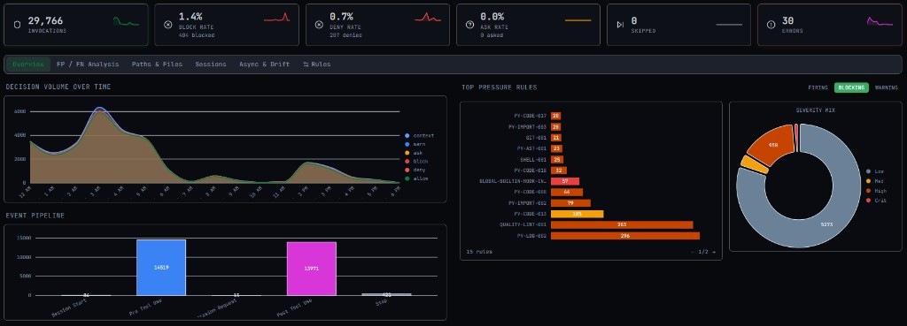

# slopgate

Global CLI guardrails engine for AI coding agents. **Real-time guardrails where the host platform supports them, plus batch code quality linting.** Claude Code has the richest runtime surface; Codex CLI and OpenCode are supported with platform-specific limitations.



## Install

Install [uv](https://docs.astral.sh/uv/) first, then either install the global CLI or work from a project venv.

```bash
# Global CLI on PATH (recommended)
uv tool install .

# From PyPI — published as `ai-slopgate` (the `slopgate` name was already taken)
# uv tool install ai-slopgate

# Development: project venv + dev tools
uv sync
uv run slopgate test
```

## Quick Start

```bash
# Initialize config (creates ~/.config/slopgate/)
slopgate config init

# Install hooks for your platform
slopgate install claude    # patches ~/.claude/settings.json
slopgate install codex     # patches ~/.codex/hooks.json
slopgate install opencode  # copies plugin to the user OpenCode plugins dir

# Or use the native all-harness installer and OS auto-updater
slopgate install all --with-autoupdate

# Run self-test
slopgate test

# Check stats
slopgate stats --days 7

# Lint the current project for code quality
slopgate lint check             # scan project; fail only on NEW violations (agent stop hooks)
slopgate lint strict            # fail on ANY violation (git pre-commit gate)
slopgate lint check --details   # extended violations + repair prognosis
slopgate lint init .            # scaffold slopgate.toml
```

## Dashboard

The [`dashboard/`](dashboard/) app visualizes Slopgate JSONL traces (`~/.config/slopgate/logs/*.jsonl`): decision volume, top rules, sessions, harness status, and rule toggles. It complements `slopgate stats` with interactive charts and file upload.

### Live dashboard (default: port 18834)

Build static assets with trace data baked in, deploy to the canvas directory, then run the API/static server:

```bash
# From repo root — local logs on this machine
make dashboard-build

# Or fetch logs + config from a remote host over SSH (default host: little)
make dashboard-build-ssh

# Serve UI + live APIs (snapshot, SSE stream, config read/write, harness status)
make dashboard-api
```

Open **http://127.0.0.1:18834/** (or `http://0.0.0.0:18834/` when `BIND=0.0.0.0`).

| Variable | Default | Purpose |
|---|---|---|
| `PORT` | `18834` | HTTP listen port |
| `BIND` | `0.0.0.0` | Bind address |
| `SLOPGATE_SSH_HOST` | `little` | SSH host for live logs, config, and harness APIs |
| `SLOPGATE_CONFIG_PATH` | `~/.config/slopgate/config.json` | Documented config path (read via SSH) |
| `SLOPGATE_TRACE_DIR` | `~/.config/slopgate/logs` | Documented trace dir (read via SSH) |

`serve.py` serves files from `~/.openclaw/canvas/forcedash` (populated by `build-standalone.py`). Without a prior build, start `serve.py` only after `build-standalone.py` has run at least once.

### UI development (port 18835)

For frontend work without the canvas deploy path:

```bash
npm --prefix dashboard install   # or: bun --cwd dashboard install
make dashboard-dev                # Vite → http://localhost:18835
```

- Starts with **mock** data unless `window.__SLOPGATE_DATA__` is injected.
- **Drop** `.jsonl` / `.ndjson` trace files onto the UI to explore local logs.
- Rule editing and harness panels need `make dashboard-api` on **18834**; Vite proxies `/api/*` to that server.

### Trace inputs

| Source | How |
|---|---|
| Hooks (live) | `events.jsonl`, `rules.jsonl`, `results.jsonl`, `subprocess.jsonl` under `~/.config/slopgate/logs/` |
| CLI summary | `slopgate stats --days 7` (terminal; no UI) |
| Dashboard upload | Drag JSONL files in dev mode |
| Baked build | `build-standalone.py` inlines recent history into the deployed `index.html` |

## Supported Platforms

| Platform | Status | Install |
|---|---|---|
| **Claude Code** | ✅ Production | `slopgate install claude [--install-scope user\|project\|both]` |
| **Cursor** | ⚠️ Partial | `slopgate install cursor [--install-scope user\|project\|both]` |
| **Codex CLI** | ⚠️ Partial | `slopgate install codex [--install-scope user\|project\|both]` |
| **OpenCode** | ⚠️ Degraded | `slopgate install opencode [--install-scope user\|project\|both]` |

`slopgate install all` is the multi-device path: each enrolled device installs hooks only for harnesses that already exist on that OS/user profile, then registers the native scheduler for that OS. Linux uses a user `systemd` timer, macOS uses a LaunchAgent, and native Windows uses `schtasks` plus a PowerShell shim. The scheduler polls the GitHub source and runs `slopgate update`, so a push to `github.com/vasceannie/slopgate` refreshes the package and rewrites the local Claude/Codex/OpenCode install sites when each device is online. Use `--include-missing` only when intentionally creating every supported harness config on that device. Pass `--disable-autoupdate` to skip the scheduler.

## Agent bundle

The [`bundle/`](bundle/) directory is the repo-owned source of truth for Slopgate-facing agent assets that are safe to share across harnesses: recovery skills, rule shards, prompt fragments, Claude agents, and MCP templates.

Local development flow:

```bash
./bundle/scripts/link-local.sh --dry-run  # review symlink targets
./bundle/scripts/link-local.sh            # link skills/rules/agents only
slopgate install all                      # hook files remain CLI-owned
./bundle/scripts/verify-local.sh
```

Important ownership boundary: the bundle **does not** symlink full prompt entrypoints (`~/.claude/CLAUDE.md`, `~/.codex/AGENTS.md`, `~/.config/opencode/AGENTS.md`) and does **not** own Claude/Codex/Cursor `hooks.json` or Claude `settings.json` hook commands. Keep hook wiring under `slopgate install ...` so install/uninstall can merge safely, back up user config, and point at the correct local binary.

For Claude Code marketplace work, `bundle/claude-plugin/` is a plugin-shaped tree and `bundle/marketplace/` is a local marketplace catalog. Build/test locally with:

```bash
./bundle/scripts/build-claude-plugin.sh --copy
claude --plugin-dir ./bundle/claude-plugin
```

## Platform Notes

- **Claude Code**: full first-class hook target. Installs into `~/.claude/settings.json` and/or `.claude/settings.json` (`--install-scope`). Slopgate uses Claude's `hookSpecificOutput` permission and `decision`/`reason` shapes per the [hooks reference](https://code.claude.com/docs/en/hooks).
- **Cursor**: native hooks via `~/.cursor/hooks.json` (user) and/or `.cursor/hooks.json` (project). Install with `slopgate install <platform>` (user default), `--install-scope project|both`, and optional `--project-root /path/to/repo`. The same flags apply to `install all`, `setup`, `update`, and `uninstall`. Slopgate maps Cursor events to its canonical model and renders Cursor-native stdout (`permission` gates, `continue` for `beforeSubmitPrompt`, `additional_context` for `postToolUse`/`afterFileEdit`, `followup_message` for `stop`/`subagentStop`). Post-tool hooks cannot hard-block edits the way Claude `PostToolUse` denial does; use `preToolUse`, `beforeShellExecution`, or `beforeReadFile` for enforcement. Tab hooks (`beforeTabFileRead`, `afterTabFileEdit`) are installed for inline-completion policy; `workspaceOpen` is not wired yet.
- **Codex CLI**: partial hooks via `~/.codex/hooks.json` and/or `.codex/hooks.json`, with `features.hooks = true` enabled in the adjacent `config.toml` when that file exists. Matchers target `Bash|apply_patch|Edit|Write`. Post-tool critical blocks use Codex's top-level `continue`/`stopReason`; other findings use `hookSpecificOutput.additionalContext` or `decision`/`reason` per [Codex hooks docs](https://developers.openai.com/codex/config-reference).
- **OpenCode**: plugin shim at the user config plugins dir and/or `.opencode/plugins/slopgate-plugin.ts`. Native events (`tool.execute.before`, `tool.execute.after`, `session.created`, `session.idle`, `permission.asked`) map to the canonical model; blocking is strongest at `tool.execute.before`. `session.idle` stop guidance is advisory (`action: continue`) because OpenCode cannot force another turn from the plugin API.

## Architecture

```
┌─────────────┐  ┌─────────────┐  ┌─────────────┐  ┌─────────────┐
│ Claude Code  │  │   Cursor    │  │  Codex CLI  │  │  OpenCode   │
│ settings.json│  │ hooks.json  │  │ hooks.json  │  │  TS plugin  │
└──────┬───────┘  └──────┬──────┘  └──────┬──────┘  └──────┬──────┘
       │                 │                 │                 │
       └─────────────────┴─────────────────┴─────────────────┘
                         ▼
              ┌────────────────────┐
              │  slopgate handle │
              │  --platform X      │
              └─────────┬──────────┘
                        ▼
              ┌────────────────────┐
              │   Rule Engine      │
              │ 87 hook rules      │
              │ (42 Py + 45 regex) │
              └─────────┬──────────┘
                        ▼
              ┌────────────────────┐
              │  Platform Adapter  │
              │  (per-platform)    │
              └────────────────────┘
```

No shell wrappers. No bootstrap scripts. Just `slopgate handle` on PATH.

## CLI

### Hook Enforcement (real-time)

```bash
# Core hook handler (called by platform hooks)
slopgate handle [--platform claude|cursor|codex|opencode]

# Replay a captured payload
slopgate replay --payload fixture.json [--platform codex] [--pretty]

# Check quality gate status for a repo
slopgate check [path]

# Install/uninstall hooks
slopgate install <platform|all> [--disable-autoupdate] [--dry-run]
slopgate uninstall <platform> [--disable-autoupdate] [--dry-run]
slopgate setup [--disable-autoupdate] [--dry-run]
slopgate update [--dry-run]

# Activity analysis
slopgate stats [--log results.jsonl] [--days N] [--json]

# Configuration
slopgate config show        # show effective config
slopgate config init        # create from defaults
slopgate config path        # print config file location

# Self-test
slopgate test

# Version
slopgate version
```

For Codex CLI and OpenCode, "real-time" should be read as best-effort within the host platform's current hook or plugin surface, not as Claude-equivalent parity.

### Code Quality Linting (batch)

```bash
# Scan the current project root for violations (compares against baseline)
# Intentionally accepts no path/file argument; use cd <project-root> first.
slopgate lint check [--details|--verbose]

# Repo-wide rebaselining is intentionally disabled
# Do not run slopgate lint baseline [path]

# One-time snapshot when baselines.json has empty rules (initial enrollment)
slopgate lint freeze

# Scaffold a slopgate.toml config
slopgate lint init [path]

# Merge missing config keys into existing slopgate.toml
slopgate lint update [path] [--dry-run]
```

Set the lint baseline file under `[paths]` in `slopgate.toml` (relative paths are resolved from the repo root):

```toml
[paths]
baseline_path = "baselines.json"
```

`slopgate lint check` prints the resolved baseline path in its header and **syncs `baselines.json` after each run**: on a clean pass it mirrors current findings (dropping stale ids); when NEW violations block the gate it only prunes fixed debt (never auto-adds NEW ids). Run `slopgate lint freeze` once while `rules` is still empty for initial enrollment. Listed stable IDs remain real defects to fix — not permission to ignore them.

#### 38 batch lint detectors

Separate from hook rule IDs: `slopgate lint check` runs these AST/static detectors project-wide (baseline-gated). The real-time hook `QUALITY-LINT-001` reuses the same detector engine on touched files after edits.

| Category | Detectors |
|---|---|
| **Parse** | python-parse-error |
| **Code smells** | high-complexity, long-method, too-many-params, deep-nesting, god-class, oversized-module, oversized-module-soft |
| **Type safety** | banned-any, type-suppression |
| **Exception safety** | broad-except-swallow, silent-except, silent-datetime-fallback |
| **Test smells** | long-test, eager-test, assertion-free-test, assertion-roulette, conditional-assertion, fixture-outside-conftest |
| **Test integrity** | untested-production-code, missing-integration-test, hypothesis-candidate, obsolete-or-deprecated-test, weak-test-assertion, mock-theater, schema-bypass-test-data, hand-built-test-payload, mocked-integration-test |
| **Duplication** | semantic-clone, repeated-magic-number, repeated-string-literal, repeated-code-block, duplicate-call-sequence |
| **Logging** | direct-get-logger, wrong-logger-name |
| **Stale code** | deprecated-pattern |
| **Wrappers** | unnecessary-wrapper |
| **Style** | long-line |

## Config Discovery

slopgate resolves config in this order:

1. `$SLOPGATE_CONFIG` (explicit file path)
2. `%APPDATA%\slopgate\config.json` on native Windows
3. `~/.config/slopgate/config.json` (XDG/POSIX)
4. `$CLAUDE_HOOK_LAYER_ROOT/.claude/hook-layer/config.json` (legacy)
5. `~/.claude/hooks/enforcer/.claude/hook-layer/config.json` (legacy default)
6. Bundled defaults

Per-repo overrides via `slopgate.toml` in the repo root.

## Rules

Slopgate has **three surfaces** that are easy to conflate:

| Surface | Count (bundled defaults) | When it runs |
|---|---:|---|
| **Real-time hooks** | **87** rule evaluations | Agent tool events (`slopgate handle`) |
| ↳ Python classes | 42 (3 always-on + 39 repo-strict) | Path/git/AST quality, post-edit lint bridge, stop/session, LangGraph, etc. |
| ↳ Regex (`config.json`) | 45 | Pattern rules for Python/TS/Rust/shell/git/config paths |
| **Batch lint** | **38** detectors | `slopgate lint check` (project-wide, baseline-gated) |

Many IDs overlap *by design* (for example `PY-CODE-013` in hooks and `god-class` / wrapper detectors in batch lint). The dashboard “top rules” chart is dominated by high-volume hook IDs such as `QUALITY-LINT-001` (post-edit touched-file lint), `PY-LOG-002`, and `PY-CODE-013` — not by the older “30 + 39” inventory.

Repo mode still applies: **outside_repo** runs only the 3 always-on safety rules; **repo_strict** (with `slopgate.toml`) runs the full 87; **repo_relaxed** drops repo-strict families but keeps always-on safety.

### Real-time hook rules (42 Python + 45 regex)

- **Always-on (3):** protected paths, sensitive data, system paths
- **Workflow & quality (repo-strict):** full-file read, git `--no-verify`, search reminders, post-edit quality commands, `QUALITY-LINT-001` / `QUALITY-POST-001`, baseline guard, enrollment, hook-infra protection, rulebook security, config-change guard, session/stop controls, bash error reinforcement
- **Python AST (19):** `PY-AST-001`, `PY-CODE-008`–`018`, `PY-EXC-001`/`002`, `PY-IMPORT-001`–`003`, `PY-LOG-002`, `PY-TEST-005`, etc.
- **LangGraph (3):** state reducers, mutation, deprecated API
- **Regex (45):** type/exception/logging/test/shell/QA-path/TS/Rust patterns in bundled `defaults.json` (override via `~/.config/slopgate/config.json`)

Availability depends on platform support:

- **Claude Code**: widest runtime coverage
- **Cursor**: partial — native `hooks.json` with Cursor-specific stdout shapes; strongest blocking on `preToolUse`, `beforeShellExecution`, and `beforeReadFile` (post-tool hooks are advisory/context-only, not hard blocks like Claude `PostToolUse` denial)
- **Codex CLI**: currently limited by Codex's narrower hook surface
- **OpenCode**: mediated through plugin event translation with advisory gaps around prompt and stop control

### Batch lint (38 detectors)

- See the **38 batch lint detectors** table under Code Quality Linting
- Configured per repo via `slopgate.toml`; only *new* violations fail the gate
- Repo-wide baseline regeneration is disabled to prevent agents from normalizing technical debt

### Declarative regex rules (45)

Configured in `config.json` (`regex_rules` in bundled defaults) — covers Python/TS/Rust quality and test patterns, shell bypasses, QA path protection, linter config guards, git reminders, and more. Disable or downgrade per rule via `disabled_rules` / `severity_overrides`.

## Per-Repo Overrides

Create `slopgate.toml` in your repo root:

```toml
[slopgate]
# Disable specific rules
disabled_rules = ["PY-CODE-013", "PY-TEST-004"]

# Downgrade rules to advisory
[slopgate.severity_overrides]
"PY-CODE-008" = "warn"

[thresholds]
max_method_lines = 80
max_params = 6
max_complexity = 15
max_nesting_depth = 5
max_line_length = 140
```

## Enforcement Modes

slopgate now enforces in two layers using `slopgate.toml` as the enrollment signal:

- **outside_repo**: no `slopgate.toml` in the current working repo root. Only always-on safety rules run.
- **repo_strict**: `slopgate.toml` exists and the repo is enabled. Always-on safety + full strict/project rules run.
- **repo_relaxed**: `slopgate.toml` exists, but `.noslopgate`, `.no-slop-gate`, or `[slopgate].enabled = false` is set. Only always-on safety rules run.

Always-on safety protections are:

- `BUILTIN-PROTECTED-PATHS`
- `GLOBAL-BUILTIN-SENSITIVE-DATA`
- `GLOBAL-BUILTIN-SYSTEM-PROTECTION`

`skip_paths` no longer bypasses the engine. Matching paths only suppress the repo-strict rule family; always-on safety still runs.

To place a repo into relaxed mode locally:

```bash
touch .noslopgate
```

Or in `slopgate.toml`:

```toml
[slopgate]
enabled = false
```

## Windows / PowerShell Notes

- Native Windows installs use the standard console scripts generated by Python
  packaging (`slopgate.exe`, `vfc.exe`, and `isx.exe`).
- Installed hook commands are quoted through a PowerShell-compatible launcher
  on Windows so paths with spaces under `AppData` can execute reliably.
- PowerShell commands are inspected for common file operations such as
  `Set-Content`, `Add-Content`, `Out-File`, `Copy-Item`, `Move-Item`, and
  `Remove-Item`.
- OpenCode plugin installs use `%APPDATA%\\opencode\\plugins` on native
  Windows and bake the discovered `slopgate.exe` path into the generated
  plugin with JSON/TypeScript-safe escaping. `SLOPGATE_BIN` can still override
  it at runtime.
- Codex CLI hook support on native Windows depends on the installed Codex
  version. When Codex hooks are unavailable or degraded on Windows, use WSL or
  Git Bash for runtime enforcement and use `slopgate lint check` natively for
  batch quality checks.
